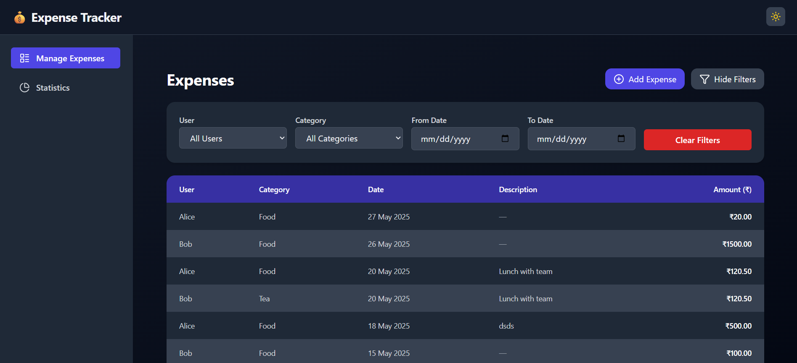

# Expense Tracker App

## Project Setup

This is an Expense Tracker application featuring two main pages: **Expense** and **Statistics**.  
The app allows users to add expenses, filter them, and view insightful statistics with predictions.

### Features
- Add, view, and filter expenses
- View monthly expenditure statistics
- Predict next month’s expenditure
- Responsive sidebar navigation between Expense and Statistics pages

### Tech Stack
- Frontend: React.js with Material UI / TailwindCSS
- Backend: Node.js with Express / Nest.js
- Database: MongoDB / MySQL (customize as per your setup)
- Authentication: JWT (if applicable)

### Installation

1. Clone the repository:
   ```bash
   git clone https://github.com/AMIT9280/expense-tracking-app
   cd expense-tracker-app

## UI Screenshots

### Expense Page




### Statistics Page


